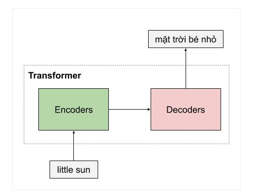

# Transformer

Hôm nay mình sẽ tìm hiểu về transformer, các phần kiến thức liên quan mình tham khảo của anh Phạm Bảo Quốc ở [link](https://pbcquoc.github.io/transformer/) sau đây. Các bạn có thể đọc kĩ hơn ở blog này nhé !

Mô hình `Transformer` là một mô hình vô cùng nổi tiếng, là nên tảng cho rất nhiều mô hình mà nổi tiếng nhất là BERT(Bidirectional Encoder Representations from Transformers) một mô hình dùng để học biểu diễn của các từ tốt nhất hiện tại và đã tạo ra một bước ngoặt lớn cho động đồng NLP trong năm 2019. Và chính Google cũng đã áp dụng BERT trong cỗ máy tìm kiếm của họ. Để hiểu BERT, các bạn cần phải nắm rõ về mô hình Transformer.

# Tổng quan mô hình
Giống như trong các mô hình dịch máy, `Transformer` bao gồm 2 phần lớn là: `Encoder`  và `Decoder`.
`Encoder` dùng để học vector biểu của câu với mong muốn rằng vector này mang thông tin hoàn hảo của câu đó. `Decoder` thực hiện chức năng chuyển vector biểu diễn kia thành ngôn ngữ đích.

Ở ví dụ dưới đây, mô hình Transformer nhận đầu vào là 1 câu tiếng anh, và encoder thành 1 vector biểu diễn ngữ nghĩa của câu `little sun`, sau đó mô hình decoder tiến hành dịch câu tiếng anh này thành câu tiêng việt.

Một ưu điểm của transformer là mô hình này có khả năng xử lí song song các từ. Các khối Encoders của mô hình `transformer` là một dạng feedforward neural network, bao gồm nhiều encoder layer khác nhau , mỗi encoder này xử lí đồng thời các từ. Trong khi đó mô hình LSTM phải xử lí các từ một cách tuần tự. Ngoài ra mô hình `Transfomer` còn xử lí 1 câu đầu vào theo 2 hướng thay vì phải stack thêm 1 mô hình LSTM nữa như trong kiến trúc Bidirectional LSTM.

Tiếp theo, chúng ta sẽ đi vào từng phần nhỏ của mô hình `Transformer`.

# Embedding Layer with Position Encoding
Trước khi đi vào mô hình Encoder, ta sẽ tìm hiểu về `Position Encoding` dùng để đưa thông tin về ` vị trí` của các từ vào mô hình `Transformer`.

Đầu tiên, các từ được biểu diễn bằng một vector sử dụng một ma trận word embedding có số dòng bằng kích thước của tập từ vựng. Sau đó các từ trong câu được tìm kiếm trong ma trận này, và được nối nhau thành các dòng của một ma trận 2 chiều chứa ngữ nghĩa của từng từ riêng biệt. Nhưng như các bạn đã thấy, transformer xử lý các từ song song, do đó, với chỉ word embedding mô hình không thể nào biết được vị trí các từ. Như vậy, chúng ta cần một cơ chế nào đó để đưa thông tin vị trí các từ vào trong vector đầu vào. Đó là lúc positional encoding xuất hiện và giải quyết vấn đề của chúng ta. Tuy nhiên, trước khi giới thiệu cơ chế position encoding của tác giả, các bạn có thể giải quyết vấn đề băng một số cách naive như sau:

Biểu diễn vị trí các từ bằng chuỗi các số liên tục từ 0,1,2,3 …, n. Tuy nhiên, chúng ta gặp ngay vấn đề là khi chuỗi dài thì số này có thể khá lớn, và mô hình sẽ gặp khó khăn khi dự đoán những câu có chiều dài lớn hơn tất cả các câu có trong tập huấn luyện. Để giải quyết vấn đề này, các bạn có thể chuẩn hóa lại cho chuỗi số này nằm trong đoạn từ 0-1 bằng cách chia cho n nhưng mà chúng ta sẽ gặp vấn đề khác là khoảng cách giữa 2 từ liên tiếp sẽ phụ thuộc vào chiều dài của chuỗi, và trong một khoản cố định, chúng ta không hình dùng được khoản đó chứa bao nhiêu từ. Điều này có nghĩa là ý nghĩa của position encoding sẽ khác nhau tùy thuộc vào độ dài của câu đó.

# Phương pháp đề xuất sinusoidal encoding
Phương pháp của tác giả đề xuất không gặp những hạn chế mà chúng ta vừa nêu. Vị trí của các từ được mã hóa bằng một vector có kích thước bằng word embedding và được cộng trực tiếp vào word embedding.

# Encoder
Encoder trong mô hình `Transformer` có thể bao gồm nhiều encoder layer tương tự nhau. Mỗi encoder layer của transformer bao gồm 2 thành phần chính là : `multi-head attention` và `feedforward network`, ngoài ra còn có cả `skip connection` và `normalization layer`.

Trong 2 thành phần chính, phần quan trọng nhất tạo nên sự khác biệt giữa LSTM và Transformer chính là `multi-head attention`.

Khối Encoder đầu tiên sẽ nhận ma trận biểu diễn của các từ được cộng với thông tin vị trí thông qua positional encoding. Sau đó ma trận này sẽ được xử lí bởi `Multi-Head Attention`. `Multi-Head Attention` bản chất là việc sử dụng nhiều `self-attention`.

# Self Attention Layer
Self Attention cho phép mô hình khi mã hoá 1 từ có thể sử dụng thông tin của những từ liên quan tới nó. Ví dụ, khi từ **nó** được mã hoá, nó sẽ chú ý vào các từ liên quan như **mặt trời**. 

Chúng ta sẽ nói qua về cơ chế hoạt động của attention qua slide dưới đây:

Trong một bài toán dịch máy, Input đầu vào là một từ tiếng việt chẳng hạn: `Tôi đang đi học`, đầu ra cần chuyển đổi từ tiếng việt này sang tiếng anh: `I go to school`.

Việc dự đoán ra từ `I` trong câu tiếng anh sẽ phụ thuộc vào các từ trong input đầu vào, giả sử trong câu này là từ `Tôi`.

Vậy giá trị `Attention Score` dùng để tính toán mức độ tương quan giữa 1 `query` ở output và các `key` ở input. Giá trị tương quan đối với `key` nào cao, có nghĩa việc dự đoán ra giá trị `query` sẽ phụ thuộc nhiều vào `key` đó.
Sau đó chúng ta chuẩn hoá các giá trị `Attention Score` về khoảng 0 - 1 bằng hàm `softmax`. Sau bước này ta có được một phân phối của Attention (Attention Distribution).
Các giá trị `alpha` này sẽ được nhân với biến `value`, trong TH này giá trị `value` = `key` để tạo ra `Attention Output` hay chúng ta có thể gọi là vector ngữ cảnh (Context Vector).

Tóm lại, ta sẽ thực hiện phép `Scaled Dot-Product Attention` kết hợp cùng với các vector `query` để thực hiện tạo dự đoán.
**Khi sử dụng cơ chế self-attention, tức là chúng ta đã cho giá trị QUERY = KEY = VALUE = EMBEDDING**

Hình ảnh minh hoạ cơ chế self-attention.
Bạn có thể tưởng tượng cơ chế self attention giống như cơ chế tìm kiếm. Với một từ cho trước, cơ chế này sẽ cho phép mô hình tìm kiếm trong cách từ còn lại, từ nào “giống” để sau đó thông tin sẽ được mã hóa dựa trên tất cả các từ trên.

# Multi Head Attention
Chúng ta muốn mô hình học được nhiều kiểu mối quan hệ giữa các từ với nhau. Với mỗi `self-attention` chúng ta học được một kiểu quan hệ, do đó để mở rộng khả năng này, chúng ta sẽ thêm nhiều `self-attention`. Như vậy, bây giờ ma trận key, query, value cần thêm 1 chiều sâu nữa.
 
`Muti Head Attention` cho phép mô hình chú ý đến từ kế sau, kế trước, và những từ liên quan của 1 từ. 
# Residuals Connection và Normalization Layer
Trong kiến trúc của mô hình `Transformer`, `residual connection` và `normalization layer` được sử dụng mọi nơi. Hai kĩ thuật này giúp cho mô hình nhanh hội tụ hơn và tránh mất mát thông tin khi mạng càng sâu.

# Decoder 

Thực hiện chức năng giải mã vector của câu nguồn thành câu đích, do đó decoder sẽ nhận thông tin từ encoder là 2 vector key và value. Kiến trúc của decoder rất giống với encoder, ngoại trừ thêm 1 lớp `multi head attention` nằm ở giữa để học được mối liên quan giữa từ đang được dự đoán với các từ  ở câu nguồn. 

# Masked Multi Head Attention
`Masked Multi Head Attention` tất nhiên là `multi head attention` mà chúng ta đã xem ở trên, có chức nằng dùng để encoder các từ trong câu đích trong quá trình dịch. Tuy nhiên lúc cài đặt, chúng ta cần phải che đi các từ ở tương lai mà mô hình chưa dịch đến. Để làm việc này, chúng ta cần nhân với 1 vector chứa các giá trị 0, 1.
*Trong quá trình decode, chúng ta còn có 1 lớp Multi Head Attention ở giữa nhân đầu vào là output từ layer phía dưới, và nhận các vector key, value từ Encoder. Mục tiêu là học sự tương quan giữa từ đang được dự đoán với từ nguồn.*
# Final Fully Connected Layer, Softmax và Loss function
Giống như nhiều mô hình khác, chúng ta cần thêm 1 lớp fully connected layer để chuyển output layer phía trước thành ma trận có chiều bằng số từ mà bạn cần dự đoán. Sau đó đến `softmax` để bạn tính được xác suất của từ xuất hiện tiếp theo là bao nhiêu.
Loss Function ở đây là hàm `Cross-Entropy`.
# Các kĩ thuật đặc biệt để huấn luyện Transformer
Để huấn luyện mô hình transformer, các bạn cần phải biết đến 2 kỹ thuật rất thú vị này. Nếu không sử dụng kỹ thuật đầu tiên về optimizer thì mô hình transformer sẽ không hội tụ được luôn đấy :)
## Optimizer
Để huấn luyện mô hình transformer, các bạn vẫn sử dụng Adam, tuy nhiên, learning rate cần phải được điều chỉnh trong suốt quá trình học theo công thức sau

Cơ bản thì learning rate sẽ tăng dần trong các lần cập nhật đầu tiên, các bước này được gọi là warm up step, lúc này mô hình sẽ ‘chạy’ tẹt ga. Sau đó learning rate lại giảm dần, để mô hình hội tụ.
## Label Smoothing
Với mô hình nhiều triệu tham số của transformer, thì việt overfit là chuyện dễ dàng xảy ra. Để hạn chế hiện tượng overfit, các bạn có thể sử dụng kỹ thuật label smoothing. Về cơ bản thì ý tưởng của kỹ thuật này khá đơn giản, chúng ta sẽ phạt mô hình khi nó quá tự tin vào việc dự đoán của mình. Thay vì mã hóa nhãn là một one-hot vector, các bạn sẽ thay đổi nhãn này một chút bằng cách phân bố một tí xác suất vào các trường hợp còn lại.

Giờ thì các bạn sẽ an tâm khi có thể để số epoch lớn mà không lo rằng mô hình sẽ overfit nặng nề.